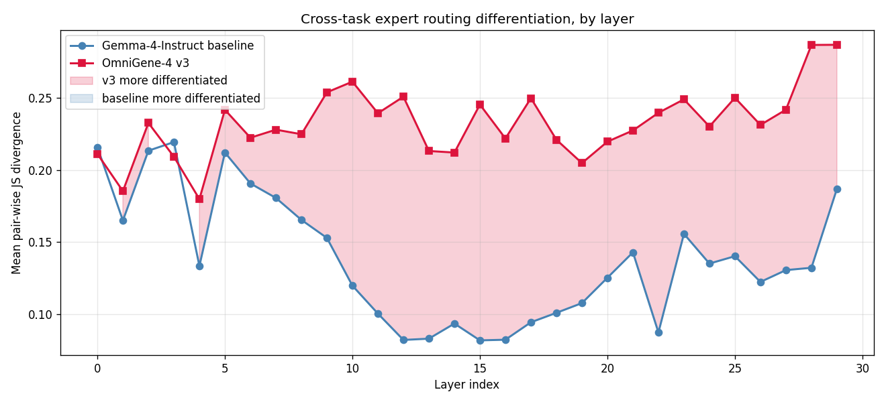
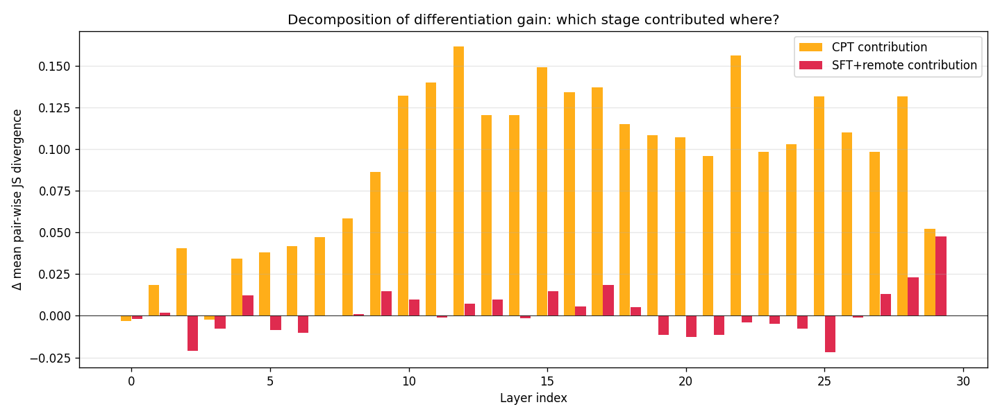
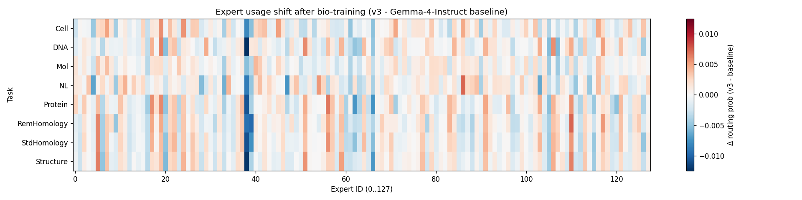
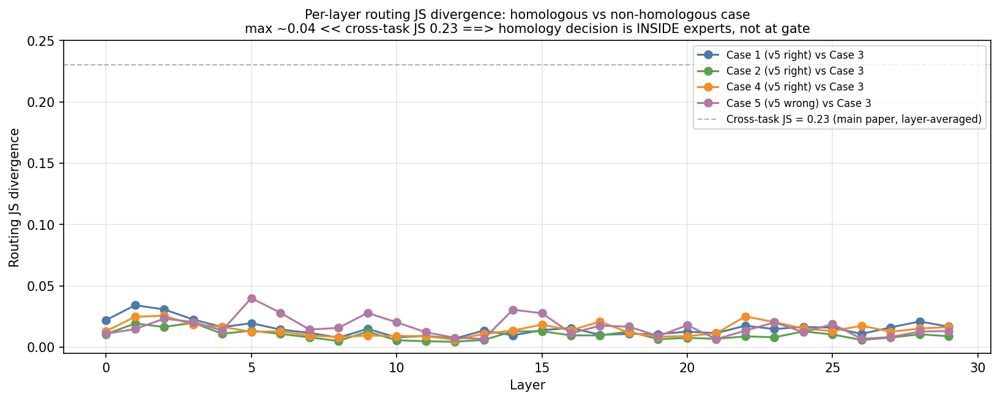
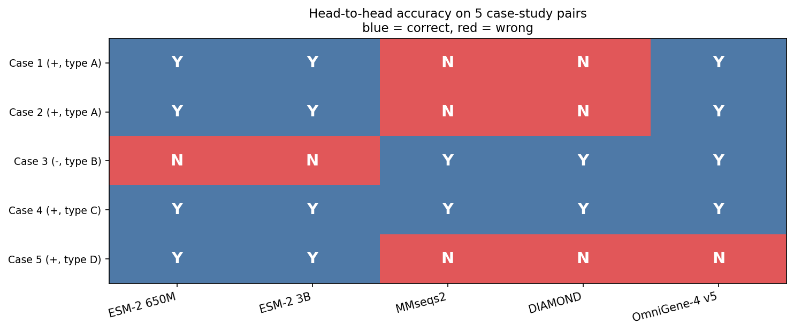

# OmniGene-4: A Unified Bio-Language MoE Model with Router-Level Interpretability

> **How do multi-modal LLMs that jointly process natural language and biological sequences (DNA, protein, structural alphabets) actually answer biological questions — especially sequence-grounded questions whose answer depends on residue-level patterns rather than literature recall?**
>
> We address this with the first router-level decomposition of a biological Mixture-of-Experts (MoE) foundation model.

📄 **Paper**: [`paper_nc/omnigene4_nc.pdf`](paper_nc/omnigene4_nc.pdf) (NC-format) · [`paper/omnigene4.pdf`](paper/omnigene4.pdf) (long version)
🧬 **Models**: [Hugging Face `dnagpt/` org](https://huggingface.co/dnagpt) (6 variants released)
📖 **Preprint**: bioRxiv [10.1101/2026.01.03.697478](https://doi.org/10.1101/2026.01.03.697478)

---

## TL;DR

A Gemma-4-26B-A4B (30 layers × 128 experts, top-8 routing) trained into a unified DNA + protein + structure + natural-language bio-foundation model. Two scientific findings beyond benchmark numbers:

1. **CPT vs SFT decomposition**: under a layer-averaged JS metric, **96% of cross-task expert differentiation comes from continued pretraining (CPT)**, only **4% from supervised fine-tuning (SFT)** — with bootstrap 95% CIs excluding zero for both. CPT reshapes middle layers (L11–L22); SFT concentrates on the final two layers (L28–L29).
2. **Gate vs experts**: within the protein-homology task family, per-pair routing divergence stays below 0.04 (vs 0.23 cross-task). The gate selects the modality; the experts compute the answer.

---

## Headline numbers

| Benchmark | Gemma-4-Instruct | v2 | v3 | v4 | **v5** | ESM-2 3B | MMseqs2 | DIAMOND |
|---|---|---|---|---|---|---|---|---|
| Standard homology (1k pairs) | 85% | 100.00% | 99.95% | 99.50% | **99.40%** | — | — | — |
| Remote homology (500 pairs) | 60% | 56.55% | 59.50% | 82.00% | **82.60%** | 51.20% | 54.40% | 53.20% |
| BixBench (T/F, general biology QA) | 87% | 91.04% | 93.66% | 90.40% | **93.66%** | — | — | — |
| Dual-head 3Di per-residue (chance 5%) | — | — | — | — | **78.6%** | — | — | — |
| Dual-head DSSP per-residue (chance 12.5%) | — | — | — | — | **100%** | — | — | — |

**Remote-homology highlights**: v5 outperforms ESM-2 3B by **+31.4 pp**, MMseqs2 by **+28.2 pp**, DIAMOND by **+29.4 pp** on the identical 500-pair sample. Scaling ESM-2 from 650M to 3B adds only **+0.7 pp**, ruling out encoder capacity as the bottleneck.

---

## The MoE router-level story

### Where does sequence-aware capability come from?



CPT does the heavy lifting. Cross-task JS rises from 0.138 (baseline) → 0.230 (CPT) → 0.232 (CPT+SFT). The middle layers L11–L22 are reshaped during CPT; SFT only re-tunes the final two layers.

### CPT vs SFT, decomposed



| Stage | ΔJS contribution | % of total |
|---|---|---|
| Baseline → CPT | **+0.092** | **96%** |
| CPT → CPT+SFT | +0.004 | 4% |

Bootstrap 95% CI: ΔCPT = [0.096, 0.097], ΔSFT = [0.003, 0.004]. Both exclude zero.

### Expert specialization heatmap



Selected interpretable experts emerging after CPT at layer 12:

| Expert | Function | Purity | Top tokens |
|---|---|---|---|
| E54 | English function-word | **80%** NL | `the`, `of`, `and`, `to`, `in` |
| E59 | DNA dinucleotide | 46% DNA | `AA`, `AT`, `TT`, `GG`, `CC` |
| E78 | Amino-acid single-letter | 35% Protein | `M`, `L`, `V`, `I`, `F` |
| E97 | Cellular-biology semantic | 28% Cell | `CD4`, `CD8`, `IL`, `TNF`, `IFN` |

### Where does the *decision* happen?



Within the protein-homology task family, per-pair routing JS stays below 0.04 across all 30 layers — more than 5× smaller than the cross-task JS of 0.23. Top-3 routed experts at L12 are the same `{E50, E9, E108}` set on all five case-study pairs, including the failure case. **The routing gate selects the modality; the experts compute the answer.**

### Head-to-head case studies



Five protein pairs spanning four scenarios:
- **Type A** (cases 1–2): alignment tools fail (no detectable sequence alignment), v5 succeeds.
- **Type B** (case 3): ESM-2 cosine false positive, v5 correctly rejects.
- **Type C** (case 4): all methods correct (sanity check).
- **Type D** (case 5): all methods fail (honest failure mode).

---

## Released models

All six model variants are on Hugging Face under [`dnagpt/`](https://huggingface.co/dnagpt):

| Model | Size | Description |
|---|---|---|
| [`OmniGene-4-CPT-v2-merged`](https://huggingface.co/dnagpt/OmniGene-4-CPT-v2-merged) | ~50 GB BF16 | CPT-only checkpoint (Gemma-4 + 32.5 GB bio CPT) |
| [`OmniGene-4-SFT-v3-merged`](https://huggingface.co/dnagpt/OmniGene-4-SFT-v3-merged) | ~50 GB BF16 | CPT + Bio-SFT v3 (early version) |
| [`OmniGene-4-SFT-v3-GGUF`](https://huggingface.co/dnagpt/OmniGene-4-SFT-v3-GGUF) | ~16 GB | v3 quantized Q4_K_M, runs on RTX 4090 |
| [`OmniGene-4-SFT-v4`](https://huggingface.co/dnagpt/OmniGene-4-SFT-v4) | ~1.9 GB | v4 LoRA adapter + embedding (requires base) |
| [`OmniGene-4-SFT-v5`](https://huggingface.co/dnagpt/OmniGene-4-SFT-v5) | ~1.9 GB | **v5** LoRA + embedding + dual-head classifiers |
| [`OmniGene-4-SFT-v5-merged`](https://huggingface.co/dnagpt/OmniGene-4-SFT-v5-merged) | ~52 GB BF16 | **v5 final** — standalone BF16 + classification heads |

---

## Repository structure

```
omnigene4/
├── paper_nc/                    # Nature Communications submission package
│   ├── omnigene4_nc.pdf         # Main (25 pages, line-numbered)
│   ├── supplementary_nc.pdf     # Supplementary (10 pages)
│   └── figures/                 # Vector + PNG figures
├── paper/                       # Original long version
│   ├── omnigene4.pdf            # 25-page preprint
│   ├── supplementary.pdf        # 15-page supp
│   ├── NC_submission_package.md # Cover letter + reviewer suggestions
│   └── NC_submission_checklist.md
├── training/                    # CPT and SFT training scripts
├── evaluation/                  # Benchmark evaluation scripts
├── analysis/                    # MoE router-level analysis pipeline
└── results/                     # Benchmark JSONs + routing matrices
```

### Key training scripts

- `training/1-prepare_cpt_data_mp.py` — 22-process CPT corpus builder
- `training/2-run_cpt.py` — 8-GPU DDP QLoRA CPT
- `training/14-train_bio_sft_v2.py` — SFT v2 (179K examples)
- `training/17-train_bio_sft_v3_remote.py` — SFT v3 (+20K remote pairs)
- `training/40-train_bio_sft_v4.py` — **v4** (Alpaca + loss masking + oversampling)
- `training/41-train_bio_sft_v5_classifier.py` — **v5** (dual-head 3Di+DSSP classifiers)
- `training/44-merge_v5_to_full.py` — v5 LoRA → BF16 merge

### Key evaluation / analysis scripts

- `evaluation/43-eval_v5_full.py` — v5 multi-task + classification heads
- `evaluation/50-esm2_3b_remote_500pair.py` — ESM-2 3B head-to-head
- `evaluation/51-classical_baselines_500pair.py` — MMseqs2 + DIAMOND
- `evaluation/52-collect_per_pair_predictions.py` — per-pair multi-method
- `evaluation/53-pick_case_studies.py` — case-study selection
- `analysis/20-collect_moe_activations.py` — router activation hooks
- `analysis/23-three_way_compare.py` — baseline vs CPT vs SFT decomposition
- `analysis/54-extract_routing_heatmap.py` — case-study routing
- `analysis/55-plot_case_studies.py` — case-study figures

---

## Methodology in one page

1. **Vocabulary injection**: 28,028 tokens added to Gemma-4-26B-A4B-Instruct (20K DNA BPE + 8K protein BPE + 20 Foldseek 3Di + 8 DSSP + control). Mean-initialized from BPE fragments. Vocab: 262,144 → 290,172.
2. **CPT**: 32.5 GB mixed corpus (DNA + protein + OpenWebText + 3Di/DSSP + instruction replay), 0.6 epoch, 8× H20 QLoRA (r=64, α=128, target modules include `router.proj`). ~100 GPU-hours.
3. **SFT v2**: 179K `{instruction, input, output}` triples across 8 task families. Single H20, 1 epoch. 11.8 h.
4. **SFT v3**: +20K remote-homology pairs. Lower LR. 13.2 h.
5. **SFT v4**: chat-tag template → pure Alpaca; loss masking on prompt tokens; Structure×3 / Mutation×2 oversampling. ~30 h. **Unlocked the Remote homology breakthrough (+22.5 pp).**
6. **SFT v5**: dual-head architecture — two linear heads on final hidden state (`2816→20` for 3Di, `2816→8` for DSSP) trained jointly with generation under `0.5·gen_CE + 0.5·cls_CE` loss. ~5 h.
7. **Router audit**: forward hooks on all 30 routers; 8 task pools × 50 prompts × 3 checkpoints. Compute per-layer cross-task JS divergence, per-task entropy, specialty scores, bootstrap CIs. Case-study routing on 5 selected protein pairs.

---

## Reproduction notes

The scripts assume:

- **Hardware**: 1–8 × NVIDIA H20 (96 GB) for training; single GPU ≥24 GB for v5 4-bit inference; RTX 4090 sufficient for v3 GGUF
- **Python 3.10+**, PyTorch 2.5+, CUDA 12.1+
- **Dependencies**: `transformers>=4.35, peft, bitsandbytes, datasets, biopython, scikit-learn`
- **Blackwell (sm_120) fix**: scripts include `transformers.integrations.moe._can_use_grouped_mm = lambda *a, **k: False` monkey-patch
- **External baselines**: MMseqs2 and DIAMOND via `conda install -c bioconda mmseqs2 diamond`

Expected paths are currently hardcoded (e.g. `/root/autodl-tmp/dnagpt/...`). Adapt `BASE_MODEL`, `CPT_DIR`, `SFT_DIR` at the top of each script. **All trained model weights are public on Hugging Face — see Released models above.**

---

## Citation

```bibtex
@article{wang2026omnigene4,
  author    = {Wang, Liang},
  title     = {{OmniGene-4}: A Unified Bio-Language {MoE} Model with Router-Level Interpretability},
  year      = {2026},
  journal   = {bioRxiv},
  doi       = {10.1101/2026.01.03.697478},
  url       = {https://github.com/maris205/omnigene4}
}
```

---

## License

Apache 2.0 (inherits from Gemma-4). Model weights inherit the same license.

## Contact

Liang Wang ([wangliang.f@gmail.com](mailto:wangliang.f@gmail.com))
School of Artificial Intelligence and Automation
Huazhong University of Science and Technology
